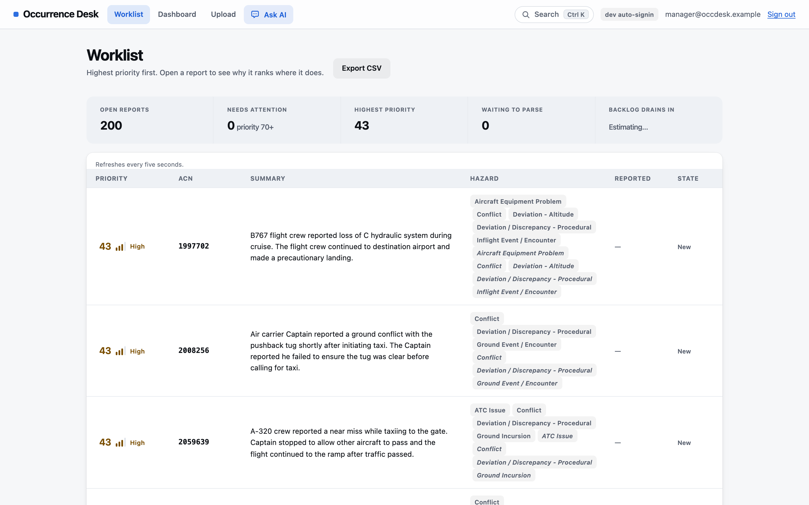
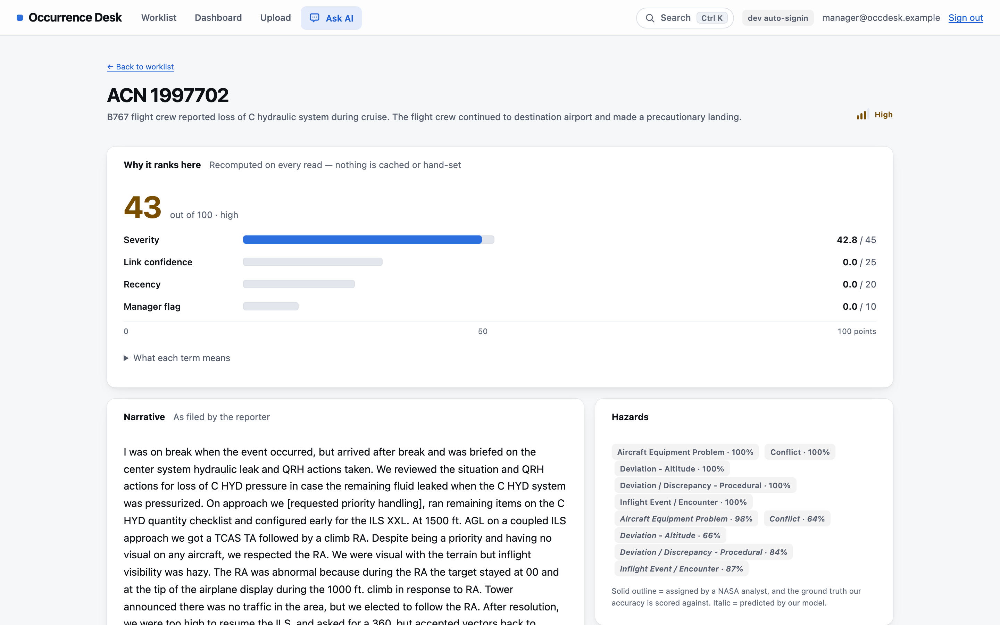
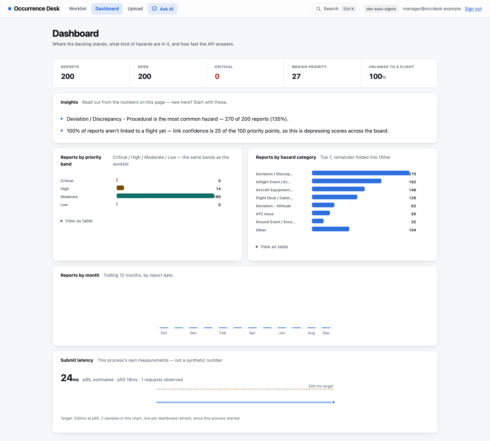
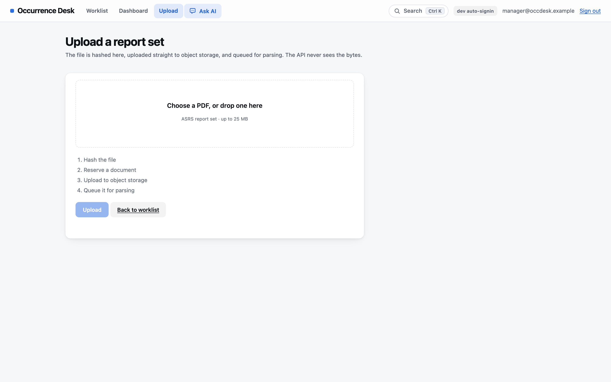
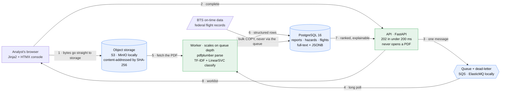
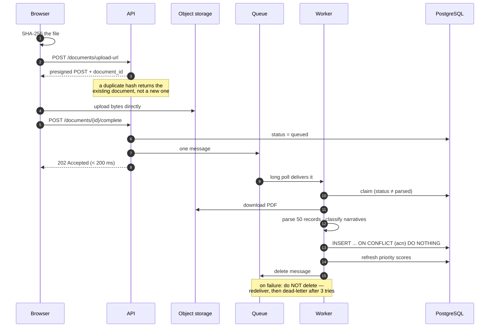

# Occurrence Desk

**Aviation safety report triage, built as a cloud system.**
Real federal data, a real queue, a real spike — and a ranked queue instead of a folder of PDFs.

[](#milestones)
[](#the-stack)
[](LICENSE)

---

## Start here: what this is, in plain terms

Airlines run voluntary safety reporting programmes. When something goes wrong — a near miss,
a fuel problem, a jammed control surface — the pilot or mechanic writes it up in their own
words. Those write-ups are **prose**, hundreds of words each, and they arrive faster than
anyone can read them.

A safety analyst's job is to read each one and answer four questions:

1. What actually happened here?
2. Which flight was it?
3. How serious is it?
4. Does it need escalating today, or can it wait?

**The bottleneck is intake, not judgement.** The analyst is good at deciding; they are slow
at opening PDFs, retyping fields into a database, and hunting for the matching flight in a
separate system. Nobody joins those two worlds until a human does it by hand.

Occurrence Desk sits in front of the analyst and does the intake. Upload a report set, and
about five seconds later you have structured, searchable, **ranked** records — each one
carrying an explanation of *why* it ranks where it does.

> ### What we deliberately do **not** claim
> NASA states plainly that ASRS reports are submitted voluntarily, are subject to
> self-reporting bias, are not verified by NASA, and **cannot be used to infer how often
> anything happens** in the airspace system. So we never say this measures aviation risk.
> We say it triages a document backlog. That distinction is the honest one, and it is load
> bearing throughout this README.

---

## What it looks like

### The ranked worklist — the analyst's home screen

Most important report first. Every row carries its score, the hazard tags, and its state.
Solid tags are NASA's own coding; italic tags are our model's prediction of the same thing,
shown side by side so you can see where they agree and where they don't.



### One report — and why it ranks where it does

The four scoring terms are shown as a breakdown, not a mystery number: severity contributes
42.8 of a possible 45, while link confidence and recency contribute nothing — and the page
shows those empty bars rather than hiding them. The score is recomputed on every read;
nothing is cached or hand-set.

The hazard card is where the ground truth shows: **solid tags are what a NASA analyst
assigned** — the labels our accuracy is scored against — and **italic tags are our model's
own prediction**, with its confidence. On this report the model agrees with all five of
NASA's categories, at confidences between 64% and 98%.

Further down the page (not shown) the "Linked flight" card reads: *"No confident match. ASRS
records are de-identified on purpose, so a link is probabilistic and sometimes there isn't
one — saying so is the honest output, not a failure."*



### The dashboard — where the backlog stands

Priority distribution, hazard mix, intake over time, and the API's own measured latency.
The "Insights" panel reads the numbers back in English, **including the unflattering ones**:
it is the dashboard itself that points out 100% of reports are unlinked and that this is
depressing every score on the page.



### Upload — the path that defines the architecture

The browser hashes the file, uploads it **straight to object storage**, then tells the API
it is there. The API never receives the bytes. This is the whole reason submissions stay
fast under load.



> Screenshots are generated from a running stack by
> [`docs/capture_screenshots.py`](docs/capture_screenshots.py), not edited by hand — re-run it
> after a UI change rather than letting them drift.

---

## How it works



### The rule the whole design serves

`POST /documents/{id}/complete` returns **202 in under 200 ms at p95, always.** It writes one
row, sends one message, and returns. **It never opens a PDF.**

That single constraint is why parsing lives in a worker, why uploads bypass the API, and why
a traffic spike lengthens a queue instead of returning errors. The moment parsing creeps onto
the request path, the project has lost its thesis.

### What happens to one upload



**Idempotency lives in two unique constraints, not in clever code.** `documents.sha256` means
the same PDF submitted twice is one row; `reports.acn` means the same ASRS record extracted
twice is one row. Object keys are content-addressed, so a duplicate upload overwrites itself
into an identical object. This survives a worker crashing mid-parse.

---

## Who this is for, and when you'd reach for it

| Use case | What Occurrence Desk does |
|---|---|
| **A safety analyst with a backlog** | Turns a folder of PDFs into a ranked queue. The most serious report is on top, and the reason is on screen. |
| **A safety manager deciding where to look** | The dashboard shows the hazard mix and priority distribution across the whole backlog, not one report at a time. |
| **Someone auditing the triage itself** | Every score decomposes into four named terms. Nothing is cached or hand-set; `/reports/{id}/why` recomputes on every read. |
| **A researcher working with ASRS data** | A deterministic parser that turns 30 report-set PDFs into 1,500 structured records with NASA's coded fields preserved verbatim. |
| **An engineer studying surge behaviour** | The system is built to be load-tested: a real December 2022 hub-closure event is replayed against it at 1,260× speed. |

**When you would not reach for it.** This is not a regulatory filing system, not an
investigation case manager, and not a compliance audit tool. See the next section for why
that matters.

---

## Where this sits among existing tools

Aviation safety software is a real, mature market. Being honest about that is more useful
than pretending we invented the category.

### The commercial platforms

[Vistair SafetyNet](https://www.aircraftit.com/vendors/vistair-systems/aviation-sms-software/),
[Ideagen Aviation Safety](https://www.ideagen.com/products/ideagen-aviation-safety),
[Q5 Systems](https://q5systems.com/industries/aviation-safety-management-software/airline-safety-management-system/),
[SMS Pro](https://en.wikipedia.org/wiki/SMS_Pro) and ASQS iQSMS are established Safety
Management System products, built around ICAO's four SMS pillars and used by real airlines.

They are strong at what we do not attempt at all: investigation workflow, corrective-action
tracking, audits, regulatory reporting, risk registers, training records, and the compliance
evidence a regulator asks for. **On features, maturity and certification, a student prototype
does not compete with them and this README will not pretend otherwise.**

What they generally share is an assumption: **a human reads the narrative and assigns the
category.** The software is the system of record and the workflow engine around that human
judgement. The prose is stored, searched and reported on — it is rarely the thing the system
itself reasons over.

### The academic work

There is a substantial research literature applying NLP to exactly our corpus — SVM and
topic-modelling approaches, and more recently
[domain-adapted transformers for multi-label ASRS classification](https://arxiv.org/pdf/2510.05451)
and [supervised models for occurrence classification](https://arxiv.org/pdf/2504.09063).
This work is generally *better at the modelling than we are* — a calibrated linear SVM is a
deliberately modest baseline next to a fine-tuned RoBERTa.

What that literature usually stops short of is a running system. A paper reports an F1 score;
it does not ship a queue, a dead-letter path, an autoscaling policy, or a console an analyst
can actually work in.

### Where we actually sit

**Between the two.** Occurrence Desk is a classification pipeline *wearing production
clothes* — and the specific combination is what's distinctive, not any single piece:

| | Commercial SMS | Research papers | **Occurrence Desk** |
|---|---|---|---|
| Reads the narrative and categorises it | rarely — a human does | **yes** | **yes** |
| Runs as a real ingest system (queue, retries, DLQ, autoscaling) | **yes** | no | **yes** |
| Explains *why* a report ranks where it does | partly | n/a | **yes — four named terms** |
| Joins reports to independent operational flight data | some | rarely | *designed for — BTS loaded, linkage query written, not yet wired (M2)* |
| Scored against labels the authors did not write | n/a | **yes** | **yes — NASA's own coding** |
| Regulatory / audit / investigation workflow | **yes** | no | **no, by choice** |

Four things we would actually defend as unusual:

1. **The ground truth isn't ours.** Each ASRS record ships with the categories NASA's own
   analysts assigned. We train on the narrative alone and score against their labels — so
   the accuracy number is graded by someone else's marking scheme, not our own.
2. **The ranking is decomposable.** Not a model score, not a black box: four weighted terms,
   recomputed on every read, each explainable in one sentence. Severity weights live in a
   database table, so changing one is a dated row update, not a code deploy.
3. **Two federal datasets that were never designed to be joined.** ASRS reports are
   deliberately de-identified; BTS on-time data has every flight number. Linking them can
   only ever be probabilistic. The BTS spine is loaded and the scored candidate query is
   written, but it is **not wired into the pipeline yet** — so today every report reads
   "no confident match," which is the honest output rather than an invented one. Closing
   that loop is the headline M2 item.
4. **Degradation is visible, not hidden.** The dashboard reports that scores are depressed
   because linkage is missing. A broken PDF lands in a dead-letter queue rather than being
   silently marked done. The UI labels model predictions distinctly from NASA's coding.

If there is one idea worth stealing here, it is the fourth: **a system that tells you what it
doesn't know is more useful than one that looks finished.**

---

## Ground truth — three real datasets, nothing invented

| Source | Role | Link |
|---|---|---|
| **NASA ASRS Report Sets** — 30 topics × 50 de-identified records = **1,500 narrative reports** (PDF) | the documents we parse and classify | <https://asrs.arc.nasa.gov/search/reportsets.html> |
| **BTS Reporting Carrier On-Time Performance** — monthly CSV, 111 fields, 1987→present | the relational spine we link reports to | <https://www.transtats.bts.gov/DL_SelectFields.aspx?gnoyr_VQ=FGJ&QO_fu146_anzr=b0-gvzr> |
| **NTSB accident database** | optional later milestone | <https://www.ntsb.gov/safety/data/Pages/Data_Stats.aspx> |
| ASRS data caveats — the honesty clause quoted above | read this before writing a claim | <https://asrs.arc.nasa.gov/search/dbol/aboutdata.html> |

**Why this corpus.** Each ASRS record is a block of NASA-coded fields
(`Assessments.Primary Problem`, `Events.Anomaly.*`, `Aircraft.Flight Phase`) followed by the
reporter's own narrative. NASA analysts read the narrative and assigned those codes. So the
narrative is our input and **somebody else's labels are our ground truth** — which is the only
kind of accuracy number worth putting on a slide.

The PDFs are not committed (they are public and downloadable):

```bash
python services/worker/fetch_report_sets.py   # all 30 sets, ~19 MB, idempotent
```

---

## Measured, not asserted

Every number below has a date and the command that produced it in
[`docs/measurements.md`](docs/measurements.md).

| What | Result |
|---|---|
| Records extracted from 30 report sets | **1,500 / 1,500**, zero schema failures |
| Field extraction vs hand-verified gold records | **P 1.000 · R 1.000 · F1 1.000** (50 records, 2,343 field pairs, all 30 sets) |
| Hazard categorisation, set-level held-out split | **micro-F1 0.78 · macro-F1 0.57** (300 held-out records) |
| Parse time per document (~50 records) | mean **3.75 s**, p99 **6.0 s** |
| Test suite | **160 passed, 7 skipped** |

**On that 1.000 extraction score.** A perfect number deserves suspicion, so: the gold records
were transcribed via a *different* PDF-reading code path than the parser uses, so agreement is
a genuine cross-check rather than the parser agreeing with itself. It reached 1.000 only after
the process found and fixed two real bugs. The sample deliberately over-weights structural
edge cases. Full reasoning is in `docs/measurements.md` and
[`eval/score.py`](eval/score.py).

**The categorisation score is deliberately unflattering.** Macro-F1 (0.57) sits well below
micro-F1 (0.78) because rare categories are genuinely harder, and we report both rather than
the prettier one. The split is by *report set*, not by record — splitting by record would put
near-identical siblings on both sides and inflate the score.

---

## The stack

| Layer | Choice | Why |
|---|---|---|
| Language | Python 3.12 everywhere | one language across API, worker and load harness |
| API | FastAPI + Pydantic v2 | the OpenAPI spec everyone codes against, for free |
| ORM / migrations | SQLAlchemy 2.0 + Alembic | reviewed, reversible migrations |
| Database | PostgreSQL 16 → Amazon RDS | real foreign keys, `jsonb`, full-text search |
| Objects | S3 (MinIO locally) | presigned uploads keep large PDFs off the request path |
| Queue | Amazon SQS (ElasticMQ locally) | durable, at-least-once, dead-letter queue |
| Workers | ECS Fargate, ARM64, autoscaled on queue depth | no servers to patch, ~20% cheaper than x86 |
| Parsing | `pdfplumber` | pure CPU — **no paid API anywhere in the pipeline** |
| Categorisation | scikit-learn TF-IDF + LinearSVC | trains in seconds, honest about its error rate |
| Front end | Jinja2 + HTMX, server-rendered | stays responsive while work is still processing |
| Infra | Terraform | the environment is a reviewable diff |
| CI/CD | GitHub Actions + OIDC | no long-lived AWS keys in repo secrets |
| Load | Locust | the harness reuses our own client code |

---

## Running it locally

Nobody needs an AWS account. MinIO speaks the S3 API and ElasticMQ speaks the SQS API, so
**application code is identical locally and on AWS** — the only difference is whether
`S3_ENDPOINT_URL` / `SQS_ENDPOINT_URL` are set. If you find yourself writing `if LOCAL:`
anywhere, stop.

**Prerequisites:** Docker Desktop running, Python 3.12+.

```bash
make init        # generate local credentials into .env
make doctor      # check Docker is reachable
make up          # postgres 16 + minio + elasticmq + api + worker
```

Then open **<http://127.0.0.1:8000/console>**.

On a local build the console signs itself in automatically, so there is no login screen to
click through. Seeded logins if you want them (local only, never in prod):
`analyst@occdesk.example` or `manager@occdesk.example`, password `occdesk-local`.

### Seeing it actually do something

The worklist starts empty. To watch the full path end to end:

1. Go to **Upload**, choose a PDF from `services/worker/sample_pdfs/`
   (run `python services/worker/fetch_report_sets.py` first if that folder is empty).
2. Watch the status move `received → queued → parsing → parsed` without reloading.
3. The worklist fills with 50 reports, ranked.
4. Click the top one to see its score broken into four terms.

```bash
make down        # stop everything
make db-reset    # clean slate (drop, create, migrate, seed)
make test        # pytest
make status      # what's running
make logs        # follow container logs
```

### Reproducing the accuracy numbers

```bash
python services/worker/fetch_report_sets.py   # the 30 NASA PDFs
python services/worker/classifier.py          # trains; writes eval/report.md + the model
python eval/score.py                          # extraction P/R/F1 vs the gold records
```

Both the corpus and the trained model are gitignored on purpose — public downloadable data
and a 20 MB derived binary. See [`services/worker/README.md`](services/worker/README.md) for
why that matters (short version: without them, model predictions silently return empty
rather than failing loudly).

---

## The console

| Page | What it is |
|---|---|
| `/console` | the ranked worklist, refreshed by an HTMX fragment every 5 s |
| `/console/reports/{id}` | one report: the four ranking terms, hazards, linked flight, narrative, and NASA's coded fields verbatim |
| `/console/dashboard` | priority distribution, hazard mix, intake by month, and this process's own measured submit latency — server-rendered SVG, no charting library |
| `/console/upload` | hashes the file in the browser, uploads straight to S3, then calls `complete` |
| `/console/login` | sign in; the token lives in `localStorage` and every HTMX request carries it |

Priority is never communicated by colour alone: every score carries a band name in text
(Critical / High / Moderate / Low) and a four-step meter, so the ranking survives colour
blindness, a greyscale printout and a screen reader. Colour pairs are contrast-checked
(worst 5.0:1 against a 4.5:1 target) in both light and dark, and htmx is vendored rather than
loaded from a CDN so the console renders with the network off.

Page shells carry no data. A browser navigation cannot send a bearer token, so each page loads
an **authenticated fragment** — the fragments are protected exactly like the API they render.

---

## The API

Version prefix `/api/v1`. Every response carries `X-Request-Id`. Errors are RFC 7807
`application/problem+json`. Full spec: [`contracts/openapi.yaml`](contracts/openapi.yaml).

| Method | Path | Role | Notes |
|---|---|---|---|
| POST | `/auth/login` | — | JWT, 60 min TTL |
| POST | `/documents/upload-url` | analyst | `{filename, byte_size, sha256}` → presigned **POST** + `document_id` |
| POST | `/documents/{id}/complete` | analyst | **202**, enqueues, never parses inline |
| GET | `/documents/{id}` | analyst | `{status, attempts, error_text, reports[]}` |
| GET | `/reports` | analyst | keyset paged; filters `category`, `state`, `priority_min`, `flight_date`, `q` |
| GET | `/reports/{id}` | analyst | coded fields, narrative, hazards, linked flight |
| GET | `/reports/{id}/why` | analyst | the four ranking terms and their products |
| POST | `/reports/{id}/disposition` | analyst | own assignments only |
| PATCH | `/reports/{id}/assign` | **manager** | 403 for analyst — and there is a test for that |
| GET | `/queue/stats` | manager | `{visible, in_flight, workers, throughput_per_min, drain_eta_seconds}` |
| GET | `/healthz` `/readyz` `/metrics` | — | liveness (checks nothing), readiness (DB + SQS), Prometheus |

`/metrics` publishes `occdesk_http_request_duration_seconds`, a histogram labelled by method,
**route template** and status — the template, never the raw path, because labelling by raw path
would mint a time series per report id. One bucket edge sits exactly on 0.2 s so the p95 SLO
query is a division rather than an interpolation.

**Presigned POST, not PUT.** POST can enforce `content-length-range` and `Content-Type`
in the policy, so a 400 MB file is rejected by S3 before it costs us a request.

### The ranked queue

An analyst does not want a list of reports; they want the *right* report first. The score
is deterministic and every term is explainable in one sentence:

```
priority = 100 × ( 0.45·severity + 0.25·link_confidence + 0.20·recency + 0.10·manager_flag )
                                                          recency = exp(−age_days / 365)
```

`severity_weight` is a column on `hazard_categories`, so the weights are **data we can
defend and change**, not magic numbers in code. `GET /reports/{id}/why` returns the four
terms and their products — because "why is this one at the top?" is the first question any
examiner asks about a ranking.

Paging is **keyset**, ordered on `(priority DESC, report_date DESC, id DESC)`. `OFFSET
50000` reads fifty thousand rows and throws them away; under the replay that is exactly
when the console would go dark.

**Two terms are currently zero for every report, and the dashboard says so.** Flight linkage
is not wired up yet, and NASA dates are month-precision (`YYYYMM`) so recency has nothing to
work with — we do not invent a day to fill the gap. That caps scores near 45 and is a known
M2 item, not a bug.

---

## Repository layout

One repo, one owner per directory. Need a change in someone else's directory? Open a PR
and tag them — do not edit around them. See [CODEOWNERS](CODEOWNERS).

```
contracts/     Nisarg   openapi.yaml, queue + extraction schemas, CHANGELOG
db/            Parva    SQLAlchemy models, alembic migrations, BTS loader
services/
  common/      shared   aws.py, settings.py, logging.py
  api/         Nisarg   FastAPI + Jinja2/HTMX console, ranking, pagination
  worker/      Smit     SQS consumer, pdfplumber parser, classifier
  replay/      Sowmya   Locust harness + BTS event replay
web/           Nisarg   templates and static assets
infra/         Wasim    terraform modules + envs, Dockerfiles, local stack
ops/           Sowmya   CloudWatch dashboard as code, alarms, runbooks
eval/          Smit     50 hand-verified gold records, score.py
tests/         unit · contract · integration · e2e
docs/          measurements.md — every number, dated, with the command that produced it
```

## The team

| Lane | Owner |
|---|---|
| Application, API & Integration *(lead)* | **Nisarg** |
| Data Model & Managed Database | Parva |
| Storage, Ingestion & Extraction | Smit |
| Infrastructure, Containers & CI/CD | Wasim |
| Queue, Autoscaling, Observability & Load | Sowmya |

---

## Milestones

| | Weeks | The bar | State |
|---|---|---|---|
| **M1** | 1–3 | Local stack end to end. One PDF uploaded, queued, parsed, visible in the worklist. Zero AWS spend. | **done** |
| **M2** | 4–7 | Everything on AWS: RDS, S3, SQS, Fargate behind an ALB, deployed by GitHub Actions. Autoscaling and dashboard live. | next |
| **M3** | 8–11 | Accuracy scored on held-out data. Real hub-closure day replayed at scale, with graphs. Cost report. | |
| **Demo** | 12 | One unbroken run, rehearsed three times. | |

**Integration day, every Friday, 90 minutes, all five.** A lane is not done for the week
until `make e2e` passes on the dev environment — not when it passes on your laptop.

## Definition of done (measurable, not adjectival)

- `POST /documents/{id}/complete` p95 **< 200 ms** while the queue holds 10,000 messages.
- Worklist page 1 and page 100 both render **< 500 ms** at 50,000 reports.
- An analyst token gets **403** on every manager-only path — one test per path.
- Same PDF twice → one `documents` row, one report set. Proven by a test.
- Extraction P/R/F1 against 50 hand-verified records; categorisation micro- **and** macro-F1
  on a **set-level** held-out split, with a per-label table and an error analysis.
- Submit latency flat at p95 through the replayed spike, **zero 5xx**, zero lost documents.

Every number lands in [`docs/measurements.md`](docs/measurements.md) with a date and the
command that produced it. The final report is that file, edited.

## Rules of engagement

1. **The contract changes by PR, never by message.** New field → PR on `contracts/`, tag
   Nisarg, add a dated line to `contracts/CHANGELOG.md`.
2. **`main` is always deployable.** Branch `feat/<lane>/<thing>`, one approving review, CI green.
3. **No migration merges without Parva's review; no Terraform without Wasim's.**
4. **No secrets in the repo, ever** — not even a local one. CI runs a secret scanner.
5. **Write the number down when you measure it.**
6. **Blocked for more than two hours? Say so.** Five lanes exist so that being blocked is unusual.

## Cost discipline

Budget is the AWS free account plan: **$100 credits at sign-up plus up to $100 earned,
expiring at six months or credit exhaustion, whichever comes first**
(<https://aws.amazon.com/about-aws/whats-new/2025/07/aws-free-tier-credits-month-free-plan/>).
An always-on ALB and a NAT Gateway will eat that before the demo, so `make cloud-down`
destroys the expensive half (ALB, ECS, NAT; RDS snapshotted) and `make deploy-dev` brings
it back with data intact. Fargate ARM at 0.25 vCPU / 0.5 GB is **$0.009875/hour ≈ $7.11 a
month** per task (<https://aws.amazon.com/fargate/pricing/>). Budget alerts at 50 / 80 /
100% of $100, to all five of us.

## Licence

MIT — see [LICENSE](LICENSE). ASRS and BTS source data remain the property of their
respective agencies and are not redistributed in this repository.
