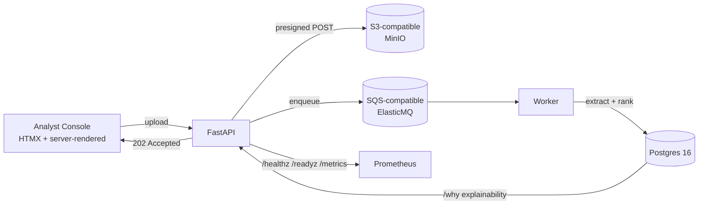

<div align="center">

# 🛬 Occurrence Desk

### Aviation safety report triage that explains every ranking decision, not just makes one

[](#accuracy--performance)
[](#accuracy--performance)
[](LICENSE)
[](#architecture)
[](ROADMAP.md)

[Quick Start](#quick-start) • [Why it exists](#why-it-exists) • [Architecture](#architecture) • [Accuracy](#accuracy--performance) • [Roadmap](ROADMAP.md) • [FAQ](#faq)

</div>

---

## Quick start

```bash
git clone https://github.com/nisarg-007/occurrence-desk.git
cd occurrence-desk
cp .env.example .env
docker compose up -d --build
```

Then open the console and upload a report — a `202` comes back in under 200ms, and the item shows up ranked in the worklist as soon as it's parsed.

## Why it exists

Aviation safety reports (ASRS, BTS, NTSB) pile up faster than analysts can triage them. Occurrence Desk takes the incoming reports, extracts structured fields from them, ranks them by an explainable priority score, and shows an analyst *why* each item ranked where it did — not just a black-box number.

The design principle driving the API is stated in the code, not just here: accept fast, explain always. Ingest returns `202 Accepted` in under 200ms, and every ranked item has a `/why` endpoint that walks the actual math behind its score.

## Architecture



| Layer | Choice |
|---|---|
| API | FastAPI, Python 3.12 |
| Database | PostgreSQL 16 |
| Object storage | S3-compatible (MinIO locally) |
| Queue | SQS-compatible (ElasticMQ locally) |
| Console | Jinja2 + HTMX, server-rendered |
| Deployment | GCE VM (Docker Compose), see [ROADMAP.md](ROADMAP.md) for what's next |

## Accuracy & performance

Measured, not estimated — against real ASRS incident data, not synthetic fixtures.

| Metric | Result |
|---|---|
| Field extraction (P / R / F1) | 1.000 / 1.000 / 1.000 across 2,343 field pairs |
| Hazard categorization | micro-F1 0.78, macro-F1 0.57 |
| Parse time | mean 3.75s, p99 6.0s |
| Submit-path latency | p95 5.10ms |
| Test suite | 115 passed, 2 skipped, ruff clean |

**What this doesn't claim:** ASRS reports are self-reported, which biases the underlying data — Occurrence Desk triages what's reported, not a ground-truth incident rate. Hazard categorization is meaningfully weaker than field extraction and is flagged as a known limitation, not smoothed over.

## Data sources

ASRS (NASA Aviation Safety Reporting System), BTS, NTSB.

## Roadmap

Full milestone-by-milestone status — what's actually done vs. planned — lives in [ROADMAP.md](ROADMAP.md). Short version: local app and cloud lift-and-shift are both done; containerized orchestration, state decoupling, and observability/automation are next.

## FAQ

**Is this a real-time incident detector?**
No. It triages *reports* people already filed — it doesn't predict incidents.

**Why explainability over a bigger black-box model?**
Because an analyst deciding what to act on first needs to trust the ranking, not just receive it. Every score has a `/why` breakdown.

**Is it production-hardened yet?**
Not yet — see [ROADMAP.md](ROADMAP.md). M1 (local) and M2 (cloud lift-and-shift + budget guardrails) are done; containerization/orchestration/observability are still ahead.

**Can I use my own report data?**
Yes — the ingestion path doesn't assume ASRS specifically, though the current accuracy numbers are measured against ASRS-formatted reports.

## License

MIT — see [LICENSE](LICENSE).
